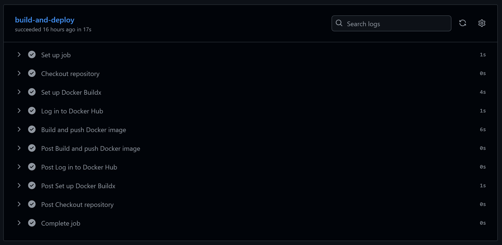

# Todo-App 
A production-ready Todo application with automated CI/CD, Docker containerization, and Terraform-managed Azure VM deployment.

## Features
- Add new tasks to your todo list
- Mark tasks as completed
- Clean, responsive design
- Simple and intuitive interface

## 📂 Project Structure
```
.
├── .github/
│   └── workflows/
│       ├── deploy.yaml            # GitHub Actions CI/CD
│── azure_deploy/                  # Terraform configs
│       ├── main.tf                # Azure VM setup
│       ├── variables.tf           # Config variables
│       ├── outputs.tf             # Public IP output
│       └── terraform.tfstate      # (Do not commit)
├── Dockerfile                     # Container config
├── index.html                     # Frontend
├── style.css                      # Styling
└── README.md                      # Documentation
```

## Getting Start

### Step-1
Run Directly
- Clone this repository
```
git clone https://github.com/yourusername/todo-app.git
```
- Open ```index.html``` in your web browser
```
open index.html 
```

### Step-2
Run with Docker
- Ensure Docker is installed on your system
- Build the Docker image:
```
docker build -t todo-app .
```
- Run the container:
```
docker run -d -p 8080:80 todo-app
```

Open your browser and navigate to http://localhost:8080
- Docker Details
    - The application is containerized using a lightweight Nginx server to serve the static files. The Dockerfile:
    - Uses the official nginx:alpine image as base
    - Copies the HTML and CSS files to the appropriate location
    - Exposes port 80 for web access

### Step-3
CI/CD Pipeline
- The GitHub Actions workflow:
    - Triggers on push to ```main``` branch
    - Builds Docker image
    - Pushes to Docker Hub
    - Includes version tagging

   

- Pipeline File Location
```.github/workflows/deploy.yaml```

- You Will se build-and-deploy in Github Action
    

### Step-4
Azure VM (Production) via Terraform
- Prerequisites:   
    - Azure CLI (```az login```)
    - Terraform installed
- Commands
```
cd azure_deploy/
terraform init
terraform plan
terraform apply -auto-approve
```
- You we see resources created in Azure portal
    !

- Output shows VM's public IP (access on port 80).
```
public_ip = "20.xxx.xxx.xxx"
```
- Visit in your browser:
```
http://20.xxx.xxx.xxx
```
- You’ll see your Umair Daily Tasks app live from Docker Hub on Azure!
    


## CI/CD Pipeline Flow
1. Code push → GitHub Actions builds Docker image
2. Image pushed to Docker Hub
3. Terraform deploys latest image to Azure VM
4. VM auto-runs container on port 80

## ⚠️ Important Notes
- Never commit terraform.tfstate* files (add to .gitignore)
- Store Azure credentials in GitHub Secrets
- VM costs accrue until destroyed


